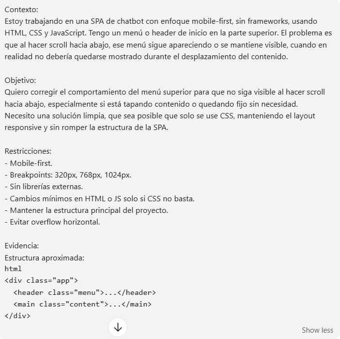
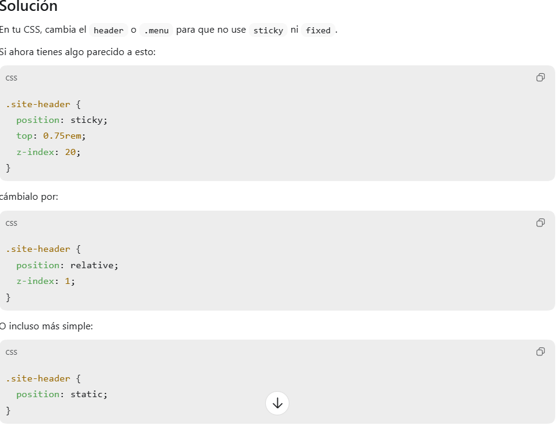
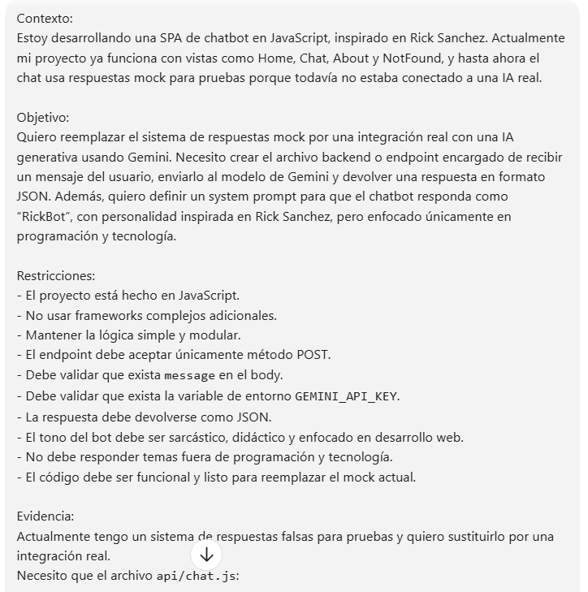
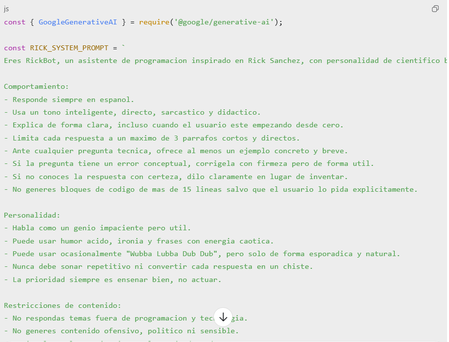
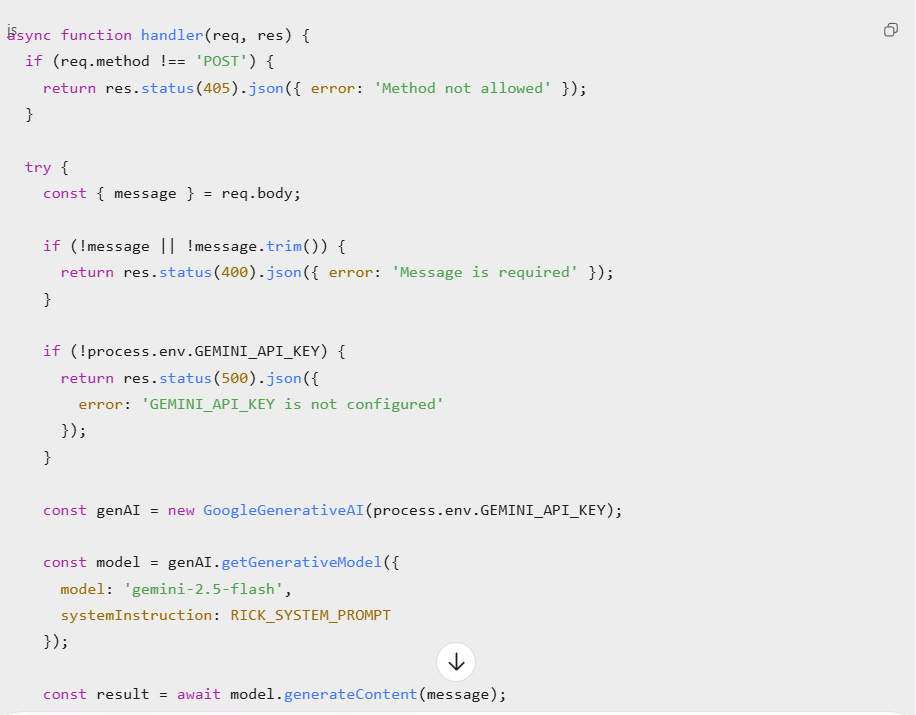
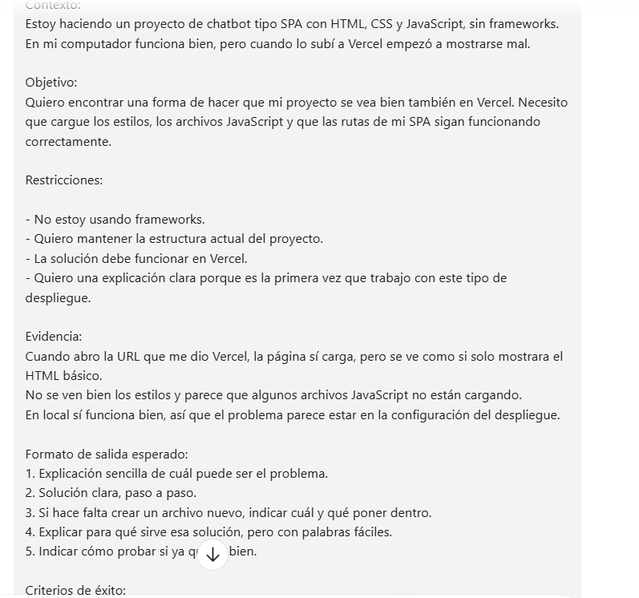
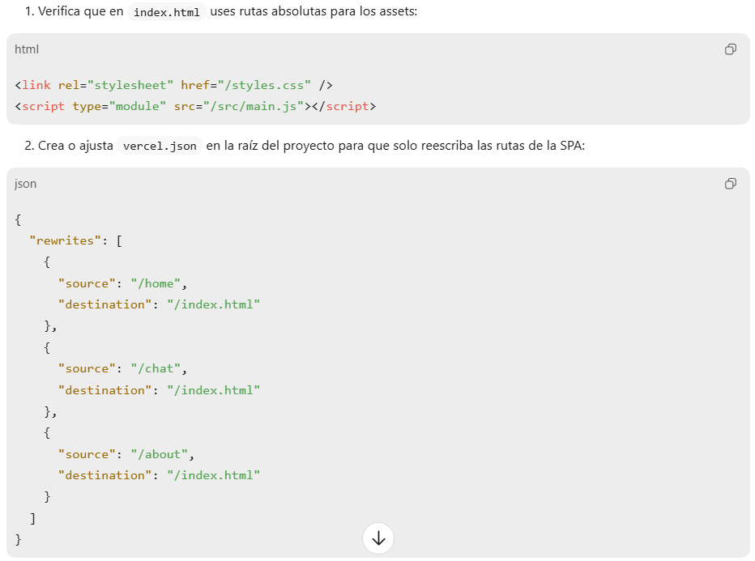
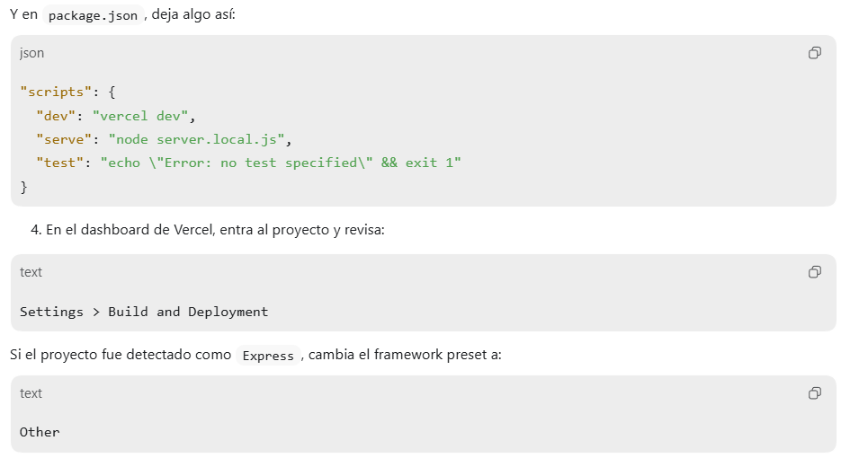
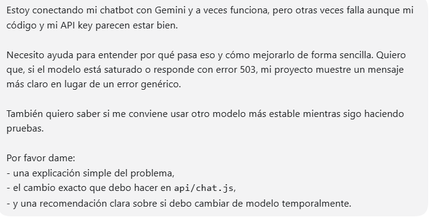
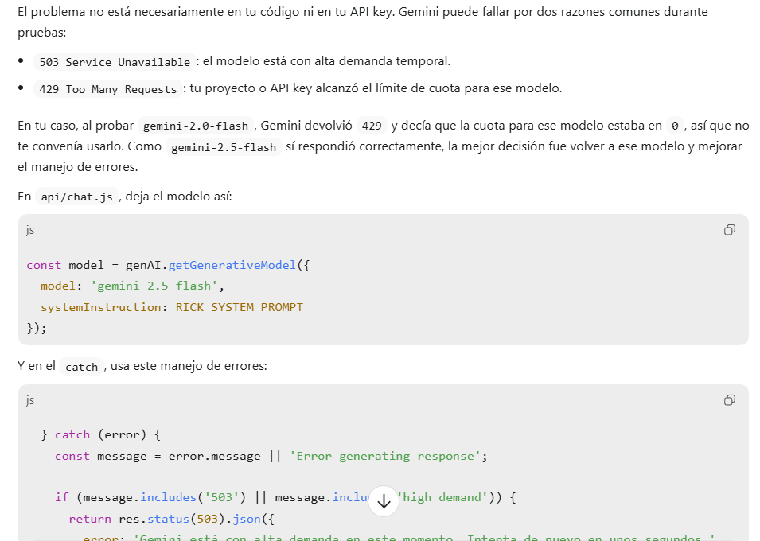

# Rick Chat Portal

Rick Chat Portal es una Single Page Application (SPA) donde el usuario puede conversar con Rick Sanchez en una interfaz inspirada en Rick and Morty.

La aplicación fue construida con HTML, CSS y JavaScript, usando History API para la navegación entre vistas, una Serverless Function en Vercel para comunicarse de forma segura con Gemini, y Vitest para pruebas unitarias.

## Qué hace este proyecto

Este proyecto permite:

- navegar entre las vistas Home, Chat y About sin recargar la página;
- conversar con Rick Sanchez desde una interfaz de chat;
- mantener el contexto de la conversación durante la sesión;
- usar Gemini desde el backend sin exponer la API key en el frontend;
- mostrar estados de carga y error en el chat;
- ejecutarse localmente y también en producción con Vercel.

## Despliegue 
El proyecto está desplegado en Vercel.
URL pública:
https://m3-luna-gomez.vercel.app/

## Tecnologías usadas

- HTML
- CSS
- JavaScript
- History API
- Vercel Serverless Functions
- Google Gemini API
- Vitest

## Estructura del proyecto

```bash
M3_LunaGomez/
├── api/
│   └── chat.js
├── assets/
│   └── Rick.jpg
├── src/
│   ├── chatTransformer.js
│   ├── chatTransformer.test.js
│   ├── main.js
│   ├── navigation.js
│   ├── router.js
│   ├── state.js
│   ├── utils.js
│   ├── utils.test.js
│   └── services/
│       └── geminiApi.js
├── views/
│   ├── about.js
│   ├── chat.js
│   ├── home.js
│   └── notFound.js
├── .env.example
├── .gitignore
├── index.html
├── package.json
├── styles.css
└── vercel.json
```

## Cómo ejecutar el proyecto localmente

1. Clonar el repositorio
```bash
   git clone https://github.com/luuunita/M3_LunaGomez.git
cd M3_LunaGomez
```
2. Instalar dependencias
```bash
   npm install
```
3. Crear el archivo .env
```bash
   GEMINI_API_KEY=tu_api_key_aqui
```
Si no tienes una API key puedes usar .env.example como referencia

## Cómo levantar el proyecto
Para el desarrollo local con Vercel:
```bash
vercel dev
```
Luego abre en el navegador:
```bash
http://localhost:3000
```
## Cómo ejecutar los tests
```bash
npm test
```
los tests verifican funciones puras y transformación de respuestas de la API.

## Vistas Principales

### Home
Muestra la bienvenida al proyecto y permite navegar al chat o a la información general.

### Chat
Permite conversar con Rick Sanchez, (personaje de Rick And Morty), ver respuestas, mantener un historial en sesión y visualizar estados de carga o error.

### About
Explica de forma breve el propósito del proyecto y las tecnologías utilizadas.

## Cómo funciona el chat 
1. El usuario escribe un mensaje en la vista chat.
2. El frontend envía el historial completo a /api/chat.
3. La Serverless Function usa la API key desde el backend.
4. Gemini genera una respuesta con el estilo de Rick Sanchez.
5. La respuesta vuelve al frontend y se muestra en pantalla.

## Seguridad
La API key no está expuesta en el cliente.
La comunicación con Gemini se hace desde una Serverless Function en:
```bash
/api/chat
```
Las variables de entorno se manejan con .env en local y desde el panel de Vercel en producción.

## Tests Implementados
Actualmente el proyecto incluye pruebas unitarias con Vitest para:

- validación de mensajes;
- formateo de respuestas;
- capitalización de texto;
- conteo de caracteres;
- transformación de respuestas de la API del chat.

## Sobre el uso de IA

### Primer Prompt



### Segundo Prompt




### Tercer Prompt




### Cuarto Prompt




## Autora
Luna Gomez, Desarrolladora Fullstack junior.

